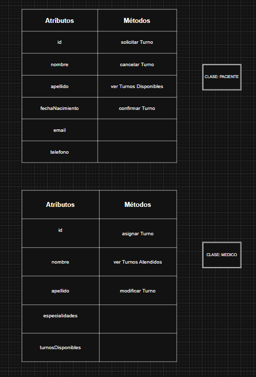
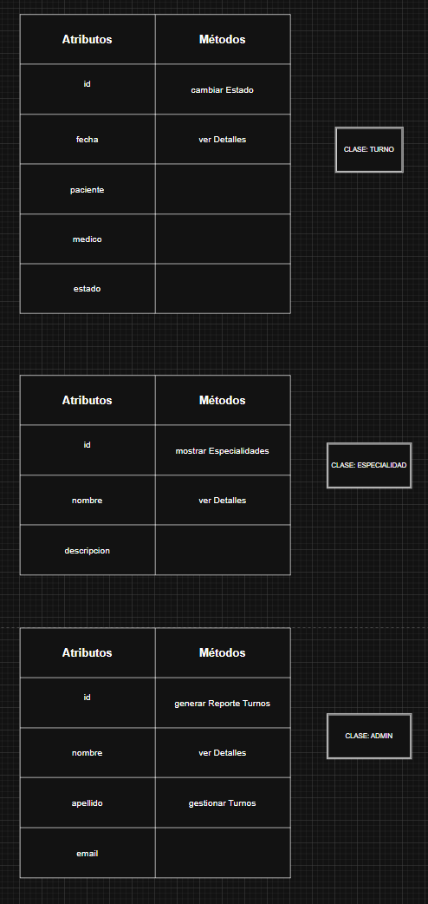

# Introducción

## 📌 ¿Qué es la Programación Orientada a Objetos?

La Programación Orientada a Objetos (POO) es un paradigma de desarrollo de software basado en la organización del código en objetos, los cuales encapsulan datos y comportamientos. Es importante porque permite una mejor modularidad, reutilización de código y escalabilidad en el desarrollo de software.

## 🔹 Los Cuatro Fundamentos de POO

1. **Abstracción:** Representa los elementos esenciales de un objeto sin mostrar detalles complejos.
2. **Encapsulamiento:** Restringe el acceso a ciertos detalles de un objeto, protegiendo su integridad.
3. **Herencia:** Permite crear nuevas clases basadas en otras existentes, promoviendo la reutilización del código.
4. **Polimorfismo:** Permite a diferentes objetos responder de distintas maneras a un mismo mensaje.

### 🌎 Ejemplo del Mundo Real
(Un boceto con una representación visual puede ser insertado aquí)

## 🛠 Requisitos Iniciales del Sistema

1. Los usuarios deben poder registrarse y autenticarse en el sistema.
2. El sistema debe permitir a los clientes solicitar turnos en línea.
3. Los empleados deben poder gestionar y confirmar turnos.
4. Debe haber notificaciones para recordatorios de turnos.
5. Se debe generar un historial de turnos para cada usuario.

## 📑 Casos de Uso

### 📌 Caso de Uso: Solicitar un Turno
- **Actor(es):** Cliente
- **Descripción:** El cliente solicita un turno a través de la plataforma.
- **Flujo principal de eventos:**
  1. El cliente inicia sesión en el sistema.
  2. Selecciona el servicio y la fecha deseada.
  3. Confirma la solicitud.
  4. El sistema registra el turno y envía una confirmación.
- **Precondiciones:** El usuario debe estar registrado e iniciar sesión.
- **Postcondiciones:** El turno queda registrado en el sistema.

## 🎨 Boceto Inicial del Diseño de Clases

# https://drive.google.com/file/d/12eZWSOb2i0ktD1hr3AVnGUYa4NfDxM9v/view?usp=sharing 

 

 

   
